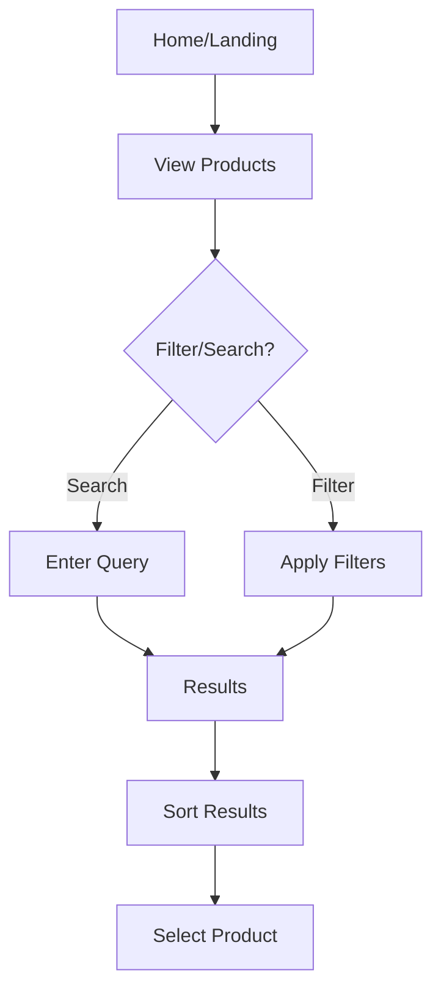
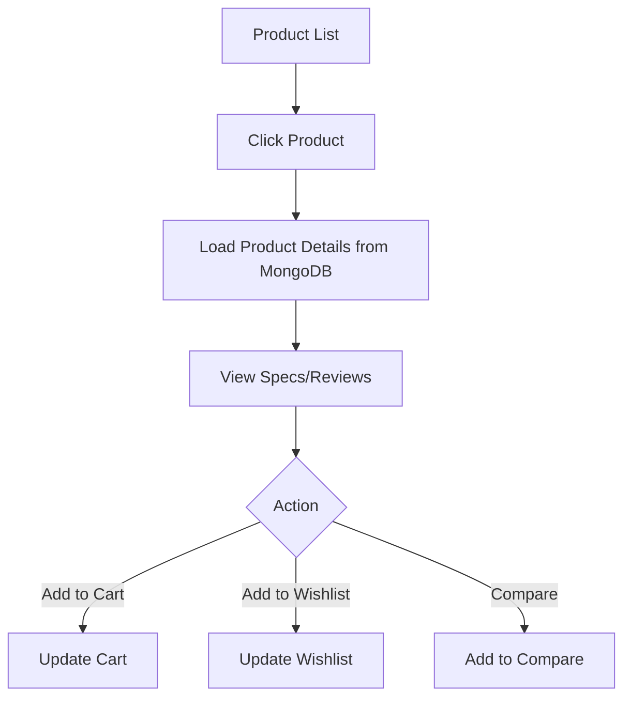
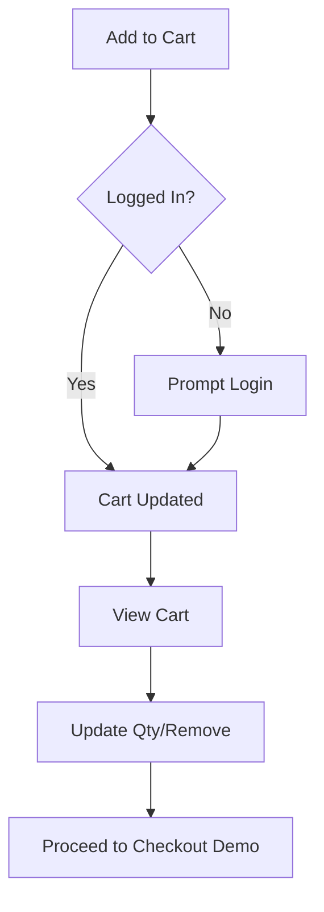

# 4. User Flows

## 4.1 Browse & Search Flow

```mermaid
flowchart TD
    A[Home/Landing] --> B[View Products]
    B --> C{Filter/Search?}
    C -->|Search| D[Enter Query]
    C -->|Filter| E[Apply Filters]
    D --> F[Results]
    E --> F[Results]
    F --> G[Sort Results]
    G --> H[Select Product]
```

## 4.2 Product Detail Flow

```mermaid
flowchart TD
    A[Product List] --> B[Click Product]
    B --> C[Load Product Details from MongoDB]
    C --> D[View Specs/Reviews]
    D --> E{Action}
    E -->|Add to Cart| F[Update Cart]
    E -->|Add to Wishlist| G[Update Wishlist]
    E -->|Compare| H[Add to Compare]
```

## 4.3 Cart Flow

```mermaid
flowchart TD
    A[Add to Cart] --> B{Logged In?}
    B -->|No| C[Prompt Login]
    B -->|Yes| D[Cart Updated]
    C --> D
    D --> E[View Cart]
    E --> F[Update Qty/Remove]
    F --> G[Proceed to Checkout Demo]
```
